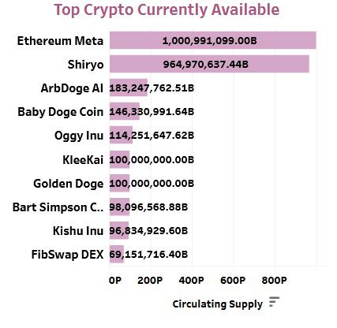
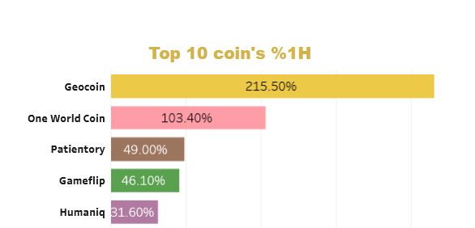
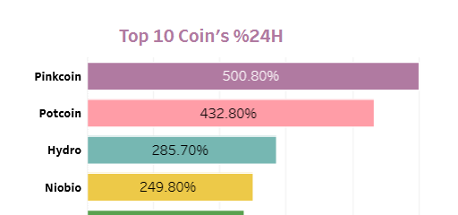
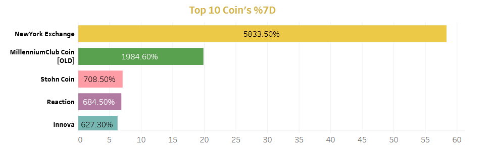
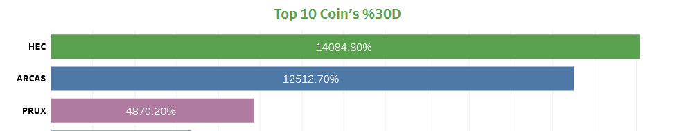
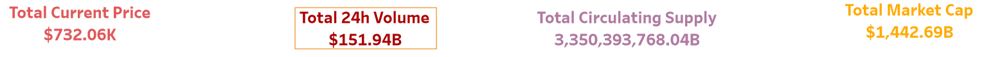
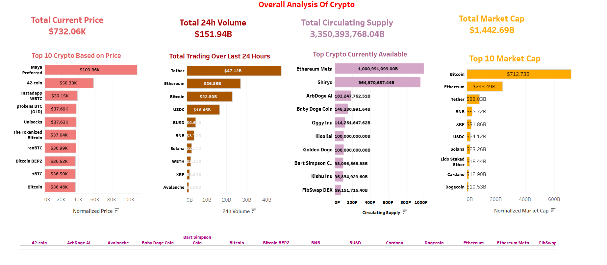
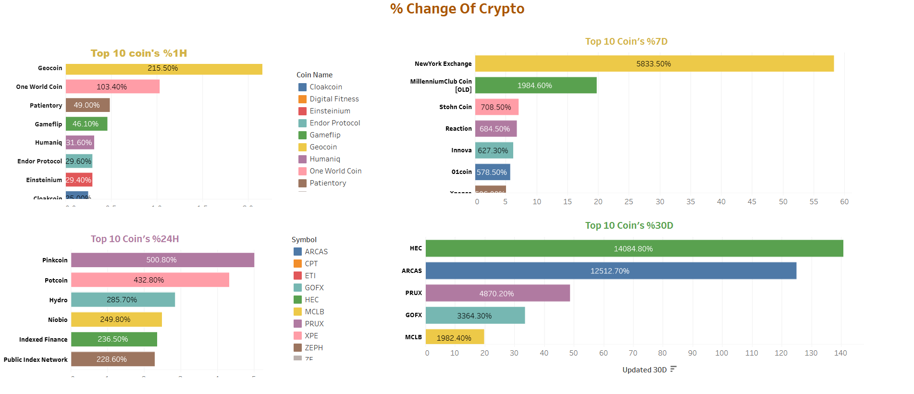

# Crypto-Currency-Analysis-Dashboard
## Problem Statement: Cryptocurrency Market Analysis
The objective of this Crypto analysis is to gain valuable insights into the cryptocurrency market from [this website](https://www.coingecko.com/en/all-cryptocurrencies).<br/> 
I collected the data using selenium library.Anyone interested can find the code [here](coingeckoupdated.py) or can also find the dataset in Kaggle from this [link](https://www.kaggle.com/datasets/mmohaiminulislam/crypto-currency-datasets).<br/>

Later I utilized the scraped data to understand the following Trends and relations using Tableau Dashboard:

1. Performance Trends: Visualize and compare the performance trends (1h, 24h, 7d, 30d) of different cryptocurrencies based on their respective Coin Names.
2. Market Metrics Overview: Create comprehensive visualizations comparing Top Coin Names against essential metrics, including Price, 24-hour Volume, Circulating Supply, and Market Cap.
3. Aggregate Metrics: Calculate and visualize aggregate metrics such as Total Market Cap, Total 24-hour Volume, and Total Circulating Supply across all cryptocurrencies.

You can visit the public dashboard from [here](https://public.tableau.com/app/profile/niloy/viz/Crypto-CurrencyAnalysisDashboard/OverallAnalysisOfCrypto).<br/>

## Expected Insights from the [Dashboard](https://public.tableau.com/app/profile/niloy/viz/Crypto-CurrencyAnalysisDashboard/OverallAnalysisOfCrypto).<br/>

1. Identification of top-performing cryptocurrencies based on various metrics like Top 10 crypto base don price, highest trading over last 24 hours, top crypto based on circulating supply, and total market cap.
    
   <table>
  <tr>
    <td></td>
    <td></td>
  </tr>
  <tr>
    <td></td>
    <td></td>
  </tr>
</table>


2. Exploration of trends and patterns in the cryptocurrency market over different time intervals.
   
    <p align="center">
  
  
</p>

<p align="center">
  
  
</p>

     
4. Understanding the aggregated market metrics to assess the overall health of the cryptocurrency market like total current price, total 24-hour volume, total circulating supply, and total market cap.<br/>

    <br/>
   

**There are two dashboards so click the button to go to the next dashboard and vice versa.** <br/>

 <br/>


## Build From Sources & Selenium Scraper 
1. Clone the repo
```bash
git clone https://github.com/niloycste/Crypto-Currency-Analysis-Dashboard.git
```
2. Initialize and Activate Virtual Environment
```bash
virtualenv env
source env/Scripts/activate
```
3. Install Dependencies
```bash
pip install -r requirements.txt
```
4. Download the Firefox web driver
```bash
https://github.com/mozilla/geckodriver/releases
```
5. Run the Scrapper
```bash
python coingeckoupdated.py
```
6. anyone can get a file name "CryptocurrencyData.csv" containing all the desired columns
## Analytics 
Tableau Public View: https://public.tableau.com/app/profile/niloy/viz/Crypto-CurrencyAnalysisDashboard/OverallAnalysisOfCrypto
